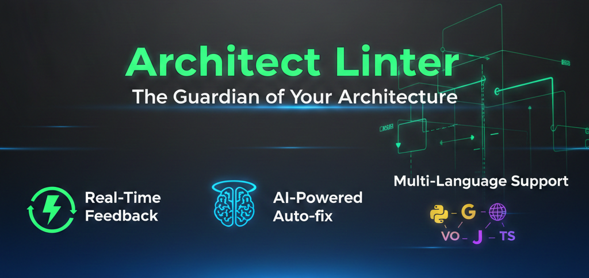

# Architect Linter Pro

<p align="center">
  
</p>

<p align="center">
  
  
  
  
</p>

A multi-language software architecture linter written in Rust.

## Documentation

👉 **[Read the complete documentation](/docs/getting-started)**

### Quick Links
- [Installation](/docs/installation)
- [Getting Started](/docs/getting-started)
- [API Reference](/docs/api-reference)
- [Guides](/docs/guides)
- [Templates](/docs/templates)
- [Troubleshooting](/docs/troubleshooting)

## Quick Install

```bash
cargo install architect-linter-pro
architect-linter-pro --init
```

## Key Features

- **Multi-Language Support** - TypeScript, JavaScript, Python, and PHP
- **Dynamic Rule Engine** - Define custom architectural constraints via `architect.json`
- **Circular Dependency Detection** - Automatically analyzes and detects dependency cycles
- **AI-Powered Auto-Fix** - Automatically suggest and apply fixes for violations
- **Health Score System** - Comprehensive project health measurement (0-100 scale)
- **Watch Mode** - Real-time monitoring with native OS notifications
- **Daemon Mode** - Background monitoring without terminal window
- **Multi-Framework Support** - NestJS, Express, React, Next.js, Django, and more
- **Git Integration** - Analyze only staged files with `--staged` flag

## Supported Frameworks

- **NestJS** - Enterprise Node.js framework
- **Express** - Minimal web framework
- **React** - Frontend library
- **Next.js** - Full-stack React framework
- **Django** - Python web framework

## License

MIT

**Languages:** English | [Español](README_ES.md)
