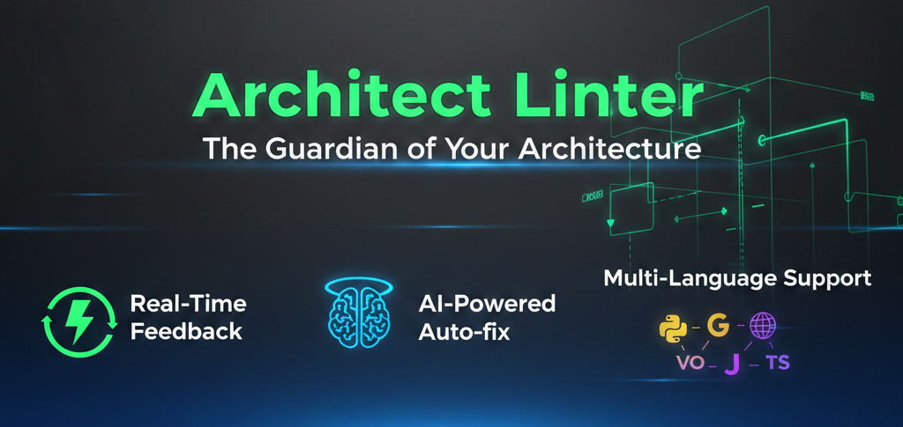

# Architect Linter Pro

<p align="center">
  
</p>

<p align="center">
  
  
  
  
</p>

A production-grade multi-language software architecture linter written in Rust with CFG-based security analysis.

## Documentation

👉 **[Read the complete documentation](/docs/getting-started)**

### Quick Links
- [Installation](/docs/installation)
- [Getting Started](/docs/getting-started)
- [API Reference](/docs/api-reference)
- [Guides](/docs/guides)
- [Templates](/docs/templates)
- [Troubleshooting](/docs/troubleshooting)

## Quick Start (v6+)

Get up and running in seconds with automatic framework detection:

```bash
# Install the latest version
cargo install architect-linter-pro

# Initialize your project (auto-detects framework)
architect init

# Run analysis
architect lint .
```

The `architect init` command automatically:
- Detects your project's framework (NestJS, Express, React, Next.js, Django)
- Generates smart defaults for your architecture rules
- Creates a ready-to-use `architect.json` configuration

## Quick Install (Alternative)

```bash
cargo install architect-linter-pro
architect-linter-pro --init
```

## Key Features

- **Multi-Language Support** - TypeScript, JavaScript, Python, and PHP
- **Dynamic Rule Engine** - Define custom architectural constraints via `architect.json`
- **Circular Dependency Detection** - Automatically analyzes and detects dependency cycles
- **AI-Powered Auto-Fix** - Automatically suggest and apply fixes for violations
- **Health Score System** - Comprehensive project health measurement (0-100 scale)
- **Watch Mode** - Real-time monitoring with native OS notifications
- **Daemon Mode** - Background monitoring without terminal window
- **Multi-Framework Support** - NestJS, Express, React, Next.js, Django, and more
- **Git Integration** - Analyze only staged files with `--staged` flag

## Supported Languages & Frameworks

### Languages
- **TypeScript/JavaScript** - Full support for modern JS ecosystems
- **Python** - Complete Python 3.x support
- **PHP** - PHP 7.4+ support

### Frameworks
| Framework | Language | Type |
|-----------|----------|------|
| **NestJS** | TypeScript | Backend (Enterprise) |
| **Express** | JavaScript/TypeScript | Backend (Minimalist) |
| **React** | JavaScript/TypeScript | Frontend |
| **Next.js** | JavaScript/TypeScript | Full-stack |
| **Django** | Python | Backend/Full-stack |

> For migration from v5, see [MIGRATION_v6.md](./docs/MIGRATION_v6.md) - Some languages were removed in v6 to focus on production use cases.

## What's New in v6

### Major Features
- **CFG-Based Security Analysis** - Control Flow Graph analysis for accurate vulnerability detection, replacing substring-based matching
- **Automatic Framework Detection** - `architect init` now auto-detects your project's framework and generates smart defaults
- **Smart Configuration System** - Context-aware config generation with production-ready presets

### Improvements
- **TaintEngine v2** - More accurate security analysis with fewer false positives
- **80%+ Test Coverage** - Production-grade code quality with comprehensive test suite
- **Integration Tests** - Real-world validation across multiple projects
- **Better Performance** - Optimized parsing and caching algorithms

### What's Deprecated
- Framework enums for Go, Java, C#, Ruby, Kotlin, Rust (no longer supported)
- Substring-based security analysis (replaced by CFG analysis)

See [CHANGELOG_v6.md](./CHANGELOG_v6.md) for complete version details.

## License

MIT

**Languages:** English | [Español](README_ES.md)
